# Consumer Revenue Intelligence
### Subscription Unit Economics: Cohort Analysis, LTV Modelling and Churn Prediction


---

## What This Project Is

I spent nine years tracking budgets for construction projects in Indonesia. Every month I would compare what we planned to spend against what we actually spent, figure out why the numbers were different, and explain it to the people who needed to make a decision. That work taught me a lot about what actually matters in a business and what is just noise.

When I started looking at subscription businesses, I noticed the same problem I used to see in project finance. The numbers that get reported are not always the numbers that tell you whether the business is actually healthy. A subscription company can show growing revenue while quietly losing money on every new customer it signs up. The headline numbers look good. The unit economics do not.

This project is my attempt to build the analysis that gets underneath the surface. It starts with a real question: if you are running a subscription service, which customers are actually worth acquiring, and which ones cost you more than they ever return?

To answer that, I pulled real track and genre data from the Spotify API for the French market, built a synthetic subscriber base of 10,000 users with realistic subscription tiers, acquisition costs, and churn behaviour, and ran the full unit economics analysis from cohort retention through to a machine learning churn prediction model. The same framework applies to any subscription or usage-based business: streaming platforms, mobility services, meal-kit delivery, gaming, or SaaS.

---

## Key Findings

All numbers below come from 10,000 synthetic subscribers built using real Spotify genre and track data (50 tracks across 20 genres, French market).

### Finding 1 - You lose most of your users in the first three months

This is the finding that should worry a growth team the most. Look at the retention table:

| Month | Retention |
|-------|-----------|
| 1     | 91.3%     |
| 2     | 85.0%     |
| 3     | 80.3%     |
| 6     | 70.0%     |
| 12    | 58.4%     |

Nearly 20% of subscribers are gone by month 3. By month 12, you have kept just over half of the people who signed up. The drop from month 1 to month 3 is sharper than anything that happens later. That means the first few weeks of a subscription are where retention is either won or lost. If a user does not build a habit in that window, they are unlikely to stay.

The practical implication is straightforward. Any money spent on retention campaigns for users who have already been active for six months is probably going to the wrong place. The intervention needs to happen earlier.

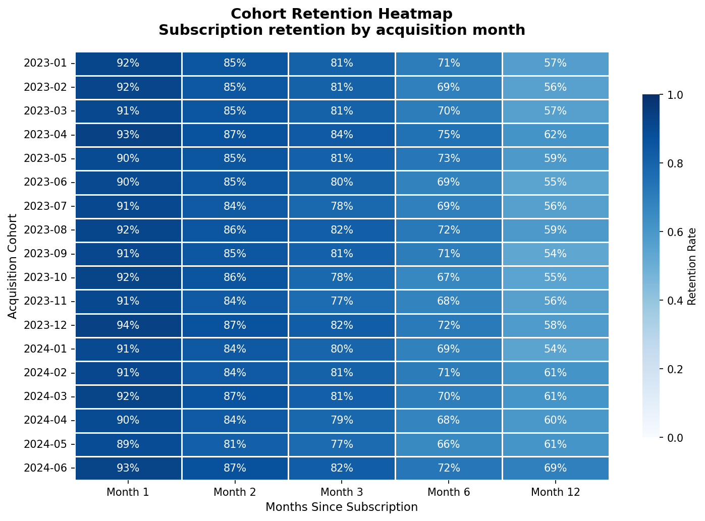
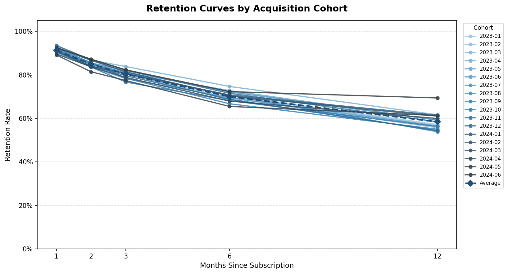

### Finding 2 - You can spend ten times more acquiring the same customer

This is the one that surprised me most when I ran the numbers. The lifetime value of a customer is roughly the same no matter which channel they came from, somewhere between 93 and 99 euros. But the cost to acquire them is not:

| Channel        | Avg LTV | Avg CPA | Net Value | LTV:CAC |
|----------------|---------|---------|-----------|---------|
| Direct         | 99 EUR  | 2 EUR   | 97 EUR    | 65.9x   |
| Referral       | 95 EUR  | 4 EUR   | 91 EUR    | 25.5x   |
| Organic Search | 95 EUR  | 6 EUR   | 89 EUR    | 19.4x   |
| Paid Search    | 95 EUR  | 22 EUR  | 73 EUR    | 4.6x    |
| Paid Social    | 93 EUR  | 18 EUR  | 75 EUR    | 5.5x    |

A customer who found you through a referral costs 4 euros to acquire. A customer who found you through a paid search ad costs 22 euros. They generate almost identical revenue over their lifetime. The LTV:CAC ratio for Direct is 65.9x. For Paid Search it is 4.6x. That is not a small difference. That is the kind of gap that, if you are not looking at it, can quietly drain a marketing budget while the total user numbers keep going up.

The right response is not to cut paid channels entirely. It is to understand what you are actually paying for growth and whether the payback period is acceptable at your current scale.

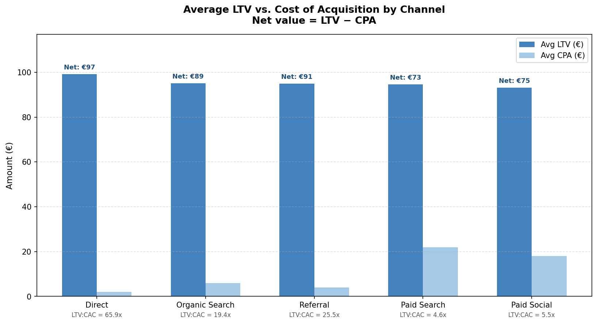
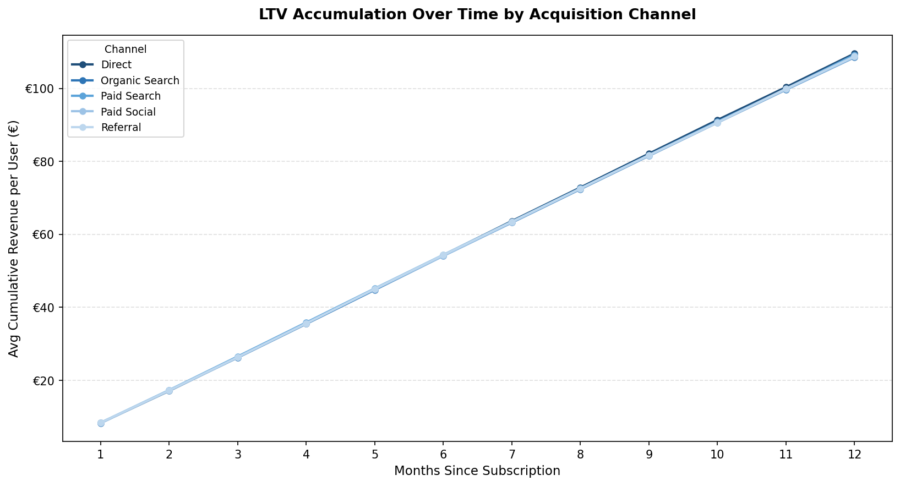
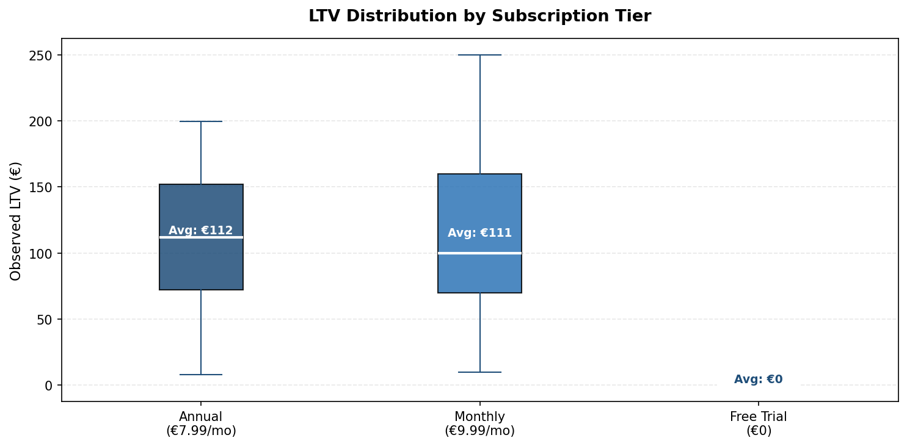

### Finding 3 - Discounts hit paid channels the hardest and fastest

At zero discount, Paid Search and Paid Social are running at LTV:CAC ratios of 4.6x and 5.5x. Those are workable numbers if you are comfortable with a multi-month payback period. The problem is what happens when you add a promotional offer.

At a 25% discount, Paid Search drops to a 2.9x LTV:CAC ratio, below the 3x threshold that most subscription businesses use as the minimum viable benchmark. At that point the channel is technically unprofitable on a per-customer basis. You are spending more to acquire and discount the customer than you are making back.

Direct and Referral channels can absorb discounts past 75% before they hit the same threshold, because their acquisition cost is low enough that there is real margin to give away. This means promotional campaigns have very different risk profiles depending on which channel you are running them through, and treating all channels the same in a discount strategy is a mistake.

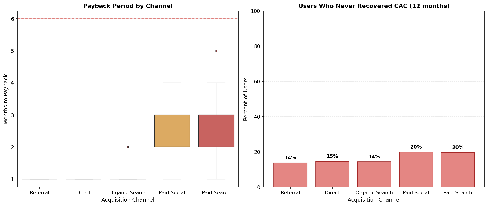
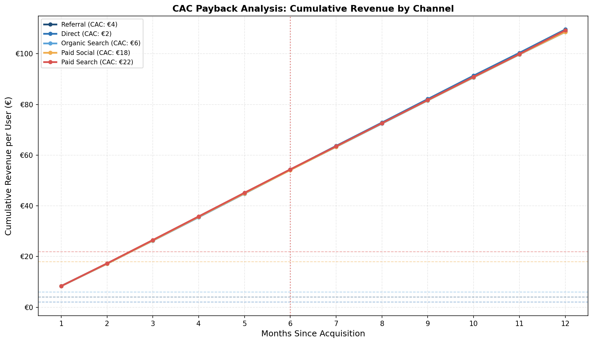
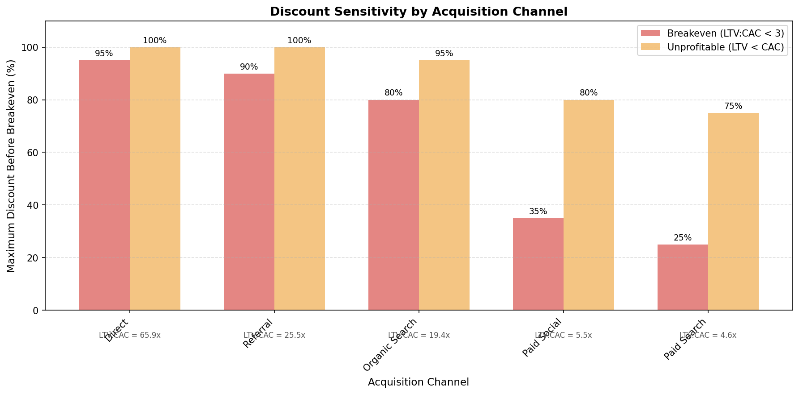
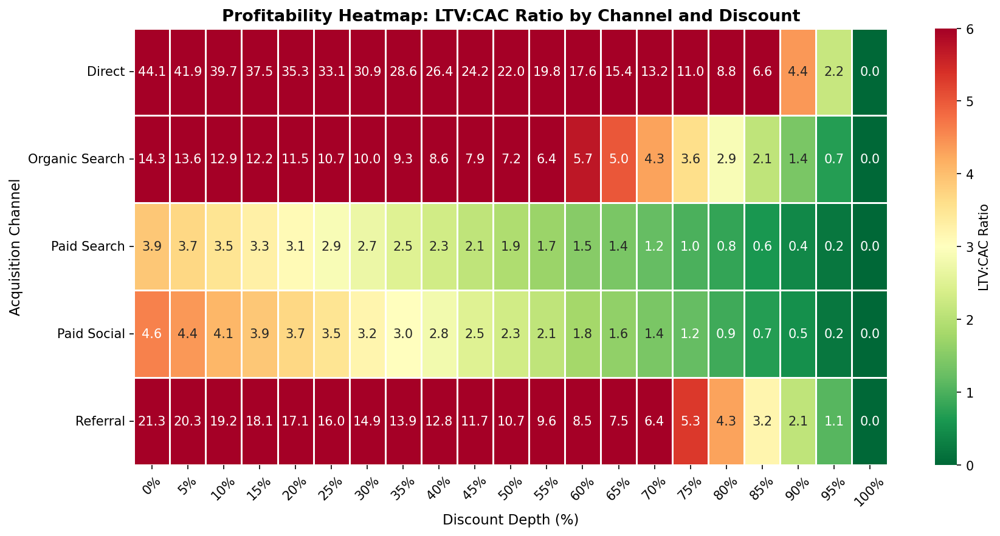

### Finding 4 - The churn model works, with one honest caveat

A Random Forest classifier trained on subscriber features identifies at-risk users with a ROC-AUC of 0.903, compared to 0.898 for Logistic Regression. The model works. But I want to be upfront about something.

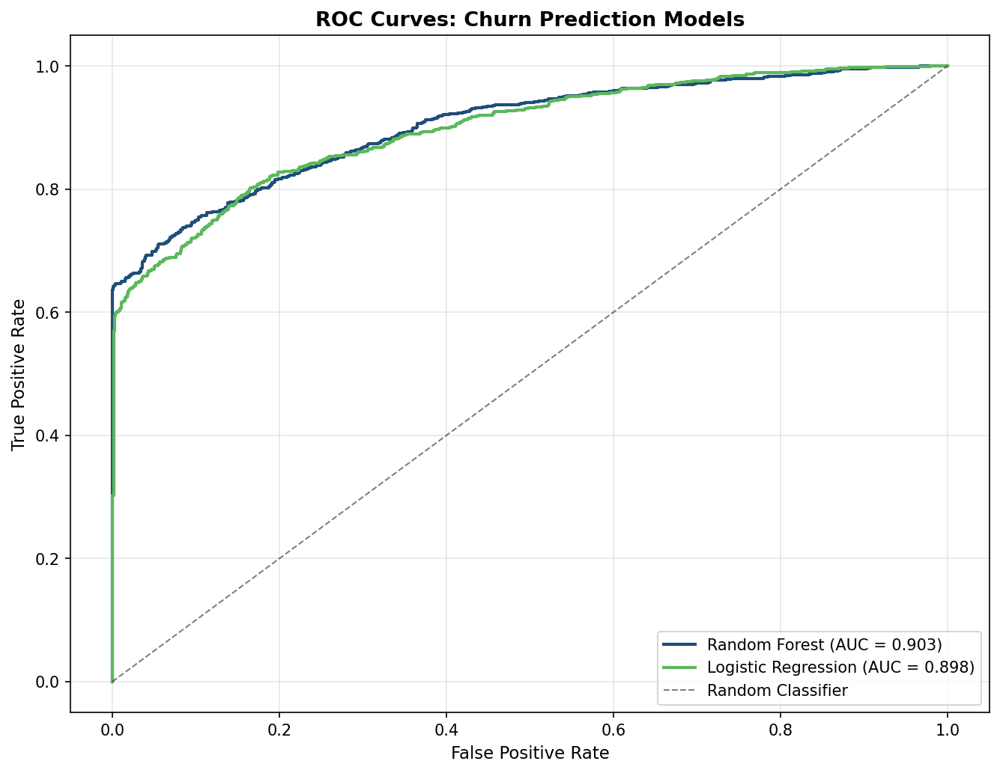
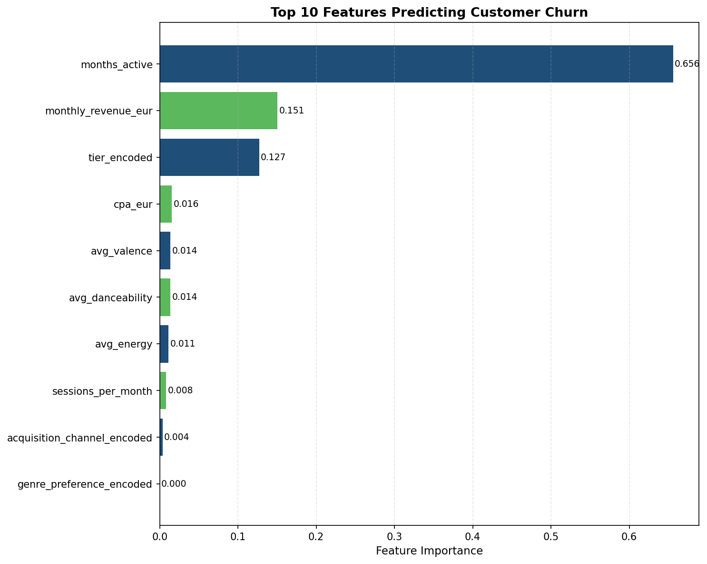
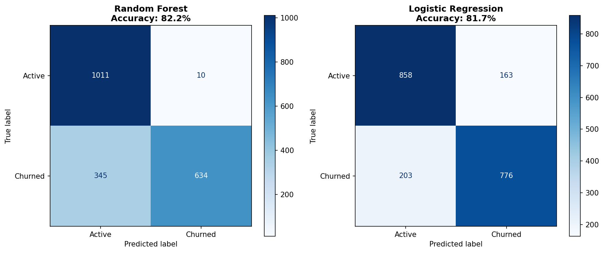
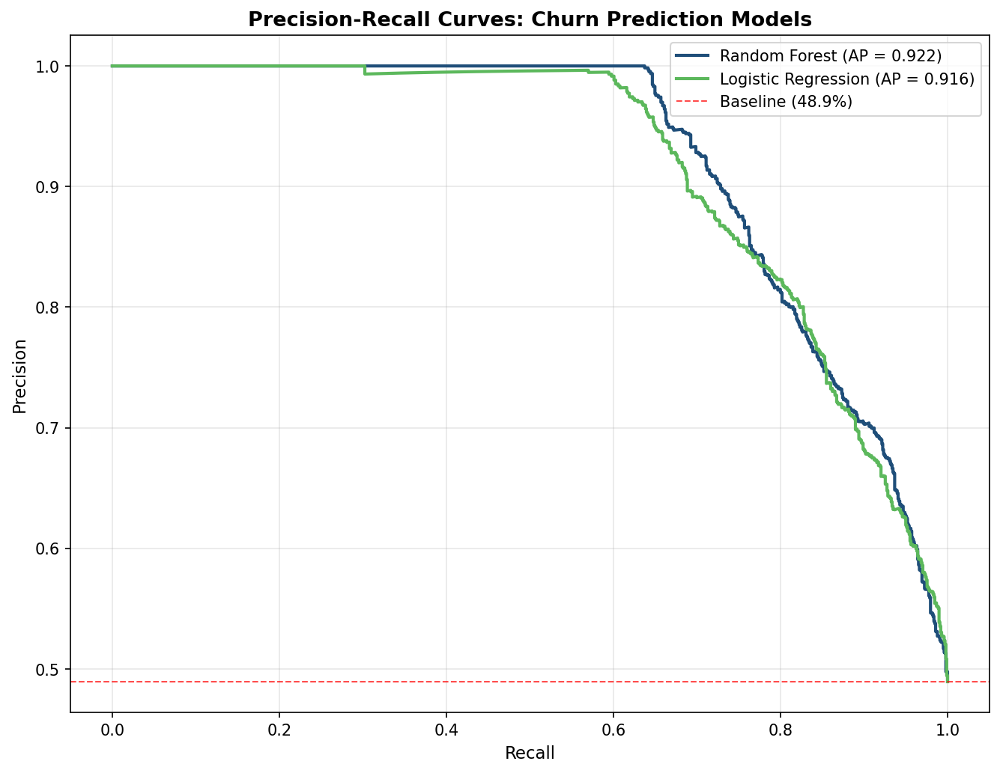

The most important feature by a significant margin is `months_active`, with an importance score of 0.656. The issue is that a churned subscriber by definition has fewer active months than one who stayed. So the model is partly predicting churn using information that is already a consequence of churn. This inflates the apparent AUC.

In a real production environment, this feature would be replaced with a rolling engagement metric measured before the churn event, such as session frequency in the previous 30 days or days since last login. I have kept it in here because it still produces a usable and explainable model, and the limitation itself is worth understanding. Knowing where a model is being circular is part of knowing how much to trust it.

---

## The Core Questions

| Question | Chapter |
|---|---|
| What percentage of users from each cohort are still active at 3, 6, and 12 months? | Ch 02 - Cohort Retention |
| How much revenue does the average user generate over their lifetime, by channel? | Ch 03 - LTV Modelling |
| How many months does it take to recover the cost of acquiring each customer? | Ch 04 - CAC Payback |
| At what discount depth does an acquisition offer become unprofitable? | Ch 05 - Discount Sensitivity |
| Which subscribers are most likely to churn before they actually do? | Ch 06 - Churn Prediction |

---

## Project Structure

```
consumer-revenue-intelligence/
|
|-- data/
|   |-- raw/                  # Spotify API output (not committed, see .gitignore)
|   |-- processed/            # Cleaned outputs per chapter
|   `-- synthetic/            # Synthetic user base with subscription and CPA data
|
|-- python/
|   |-- 00_spotify_fetch.py        # Pull track data from Spotify API across 20 genres
|   |-- 01_generate_users.py       # Generate 10,000 synthetic subscribers
|   |-- 02_cohort_retention.py     # Cohort retention table and heatmap
|   |-- 03_ltv_modelling.py        # LTV by acquisition channel and tier
|   |-- 04_cac_payback.py          # CAC payback period analysis
|   |-- 05_discount_sensitivity.py # Discount depth vs. profitability
|   `-- 06_churn_prediction.py     # Random Forest and Logistic Regression models
|
|-- outputs/
|   `-- charts/               # 14 generated charts
|
|-- sql/                      # BigQuery SQL for cohort construction reference
|-- tableau/                  # Tableau workbook (in progress)
|-- docs/                     # Build guide and project documentation
|-- requirements.txt
`-- README.md
```

---

## Chapter Descriptions

**Ch 00 - Spotify Data Collection** (Python, Spotify API)

Connects to the Spotify API using Client Credentials authentication and pulls track metadata across 20 music genres in the French market. This gives the project a real, live data source rather than a static downloaded file, and grounds the listener segments in actual genre distributions from Spotify France. Output is `spotify_tracks.csv` with around 50 tracks per genre, including popularity score, artist name, album, release date, and explicit flag.

One thing worth noting: Spotify removed access to the `/audio-features` endpoint for new apps in late 2024. Because of this, the genre-based audio profiles (energy, valence, danceability) used in the next chapter are generated synthetically using realistic per-genre parameter ranges rather than pulled from the API directly.

**Ch 01 - Synthetic User Generation** (Python)

This is where the project builds its subscriber base. 10,000 users are created with genre preferences drawn from the real Spotify genre distribution, so the mix of pop, jazz, hip-hop, and other listeners reflects what actually exists on the platform in France rather than being randomly assigned. Each user gets a subscription tier, an acquisition channel, a cost-per-acquisition drawn from realistic channel benchmarks, and a monthly revenue figure. Churn probability is set by the tier base rate and adjusted based on how engaged the user's listening profile suggests they are. Subscription histories are then simulated month by month from January 2023 to December 2024.

The reason for building synthetic users rather than using a pre-existing churn dataset is control. With a synthetic layer on top of real Spotify data, it is possible to test specific hypotheses about channel economics and discount sensitivity in a way that a static dataset would not allow.

**Ch 02 - Cohort Retention Analysis** (Python)

Groups users by the month they subscribed and tracks what percentage are still active at months 1, 2, 3, 6, and 12. The output is a retention heatmap and a set of retention curves, one per cohort, with the average across all cohorts overlaid. Average 12-month retention is 58.4%. The heatmap makes it easy to spot whether any particular cohort performed significantly better or worse than the others, which would suggest something changed in that period, whether in the product, the onboarding process, or the mix of users being acquired.

**Ch 03 - LTV Modelling** (Python)

Calculates total observed lifetime value per user, which is the sum of monthly revenue from subscription start to churn or the end of the observation window. This is then broken down by acquisition channel and subscription tier to answer the question that matters most: which channels bring in customers who are actually worth the price of acquiring them. The key finding is that LTV is broadly similar across channels but CPA differs by up to 10x, which means the LTV:CAC ratio is almost entirely driven by how much you spend on acquisition rather than how much the customer ultimately pays.

**Ch 04 - CAC Payback Period** (Python)

For each user, this chapter finds the month where their cumulative subscription revenue first covers what it cost to acquire them. Direct, Referral, and Organic Search users typically hit that point in month 1. Paid Social and Paid Search users take between 2 and 4 months, and around 20% of users from those channels never recover their acquisition cost within the 12-month window before churning. That 20% figure is important. It means one in five paid channel customers is a net loss before they even leave.

**Ch 05 - Discount Sensitivity Analysis** (Python)

Runs a simulation of promotional discounts from 0% to 100% in 5% steps and calculates the resulting LTV:CAC ratio for each acquisition channel at each discount depth. The purpose is to identify where each channel crosses the 3x LTV:CAC benchmark that most subscription businesses use as a minimum threshold for healthy unit economics. The finding is that paid channels cross that line quickly, Paid Search at 25% discount, while low-cost channels like Direct can absorb much deeper discounts without destroying the margin.

**Ch 06 - Churn Prediction Model** (Python, scikit-learn)

Trains a Random Forest and a Logistic Regression model on subscriber features to identify who is most likely to churn. The Random Forest reaches a ROC-AUC of 0.903. The outputs cover four charts: ROC curves comparing both models, feature importance for the Random Forest, a confusion matrix, and a precision-recall comparison. The chapter also includes an honest discussion of the `months_active` feature and why its dominance in the model needs to be understood carefully before using the predictions in a real intervention.

---

## Data Sources

**Primary source:** [Spotify Web API](https://developer.spotify.com/documentation/web-api), track metadata across 20 genres in the French market, accessed using Client Credentials flow with no user authentication required.

**Synthetic subscription layer:** 10,000 subscribers generated using industry-realistic assumptions for subscription tiers, acquisition channels, cost-per-acquisition, and churn behaviour. The genre preferences of each subscriber are grounded in the real Spotify data, so the user distribution reflects actual listening patterns rather than arbitrary assignments.

Raw data and synthetic user files are not committed to this repository. All processed outputs in `data/processed/` and all charts in `outputs/charts/` are included.

---

## Tools and Stack

| Layer | Tool |
|---|---|
| Data source | Spotify Web API (Client Credentials) |
| Data processing and modelling | Python 3.11, pandas, numpy, scikit-learn, matplotlib, seaborn |
| Machine learning | scikit-learn 1.4, RandomForestClassifier, LogisticRegression |
| Dashboard | Tableau Public (in progress) |
| Version control | Git / GitHub |
| Development environment | VS Code |

---

## Build Status

| Chapter | Status |
|---|---|
| Ch 00 - Spotify API data collection | Done |
| Ch 01 - Synthetic user generation (10,000 users) | Done |
| Ch 02 - Cohort retention heatmap and curves | Done |
| Ch 03 - LTV modelling by channel and tier | Done |
| Ch 04 - CAC payback period analysis | Done |
| Ch 05 - Discount sensitivity analysis | Done |
| Ch 06 - Churn prediction model (RF and LR) | Done |
| Ch 07 - Tableau Public interactive dashboard | In progress |
| Ch 08 - Executive summary memo | In progress |

---

## How to Run

```bash
# Clone the repository
git clone https://github.com/richhuwae/consumer-revenue-intelligence.git
cd consumer-revenue-intelligence

# Install dependencies
pip install -r requirements.txt

# Set up Spotify API credentials
cp .env.example .env
# Edit .env and add your SPOTIFY_CLIENT_ID and SPOTIFY_CLIENT_SECRET
# Register a free app at developer.spotify.com

# Run the pipeline in order
python3 python/00_spotify_fetch.py        # pulls Spotify track data, takes around 5 minutes
python3 python/01_generate_users.py       # generates the synthetic user base
python3 python/02_cohort_retention.py     # cohort retention analysis
python3 python/03_ltv_modelling.py        # LTV by channel and tier
python3 python/04_cac_payback.py          # CAC payback period
python3 python/05_discount_sensitivity.py # discount sensitivity
python3 python/06_churn_prediction.py     # churn prediction model
```

---

## About This Project

I built this during my MSc in Data Management at KEDGE Business School in Bordeaux. Before that I spent nine years doing financial work for a small construction company in Indonesia: budget control, variance analysis, cost forecasting, and a lot of manual work in Excel that I knew should have been done differently.

Coming back to study, I wanted to build something that connected the financial instincts I already had with the technical tools I was learning. Subscription unit economics felt like the right problem because it is genuinely complex, the stakes are real, and the analysis sits exactly at the intersection of finance and data science.

This project is the result of that.

**Author:** Edwin Richard Huwae
**GitHub:** [@richhuwae](https://github.com/richhuwae)
**LinkedIn:** [Edwin Richard Huwae](https://linkedin.com/in/edwinrichardhuwae)
